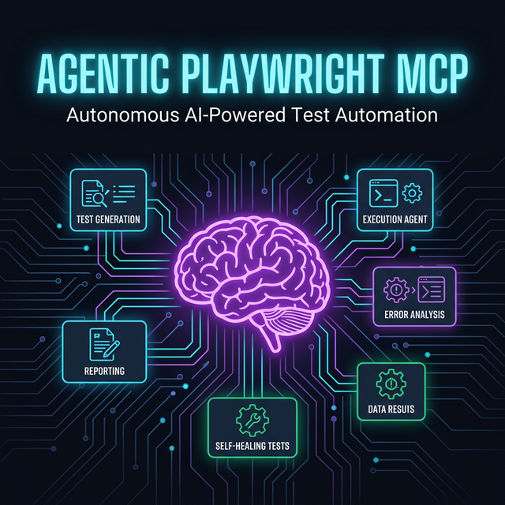
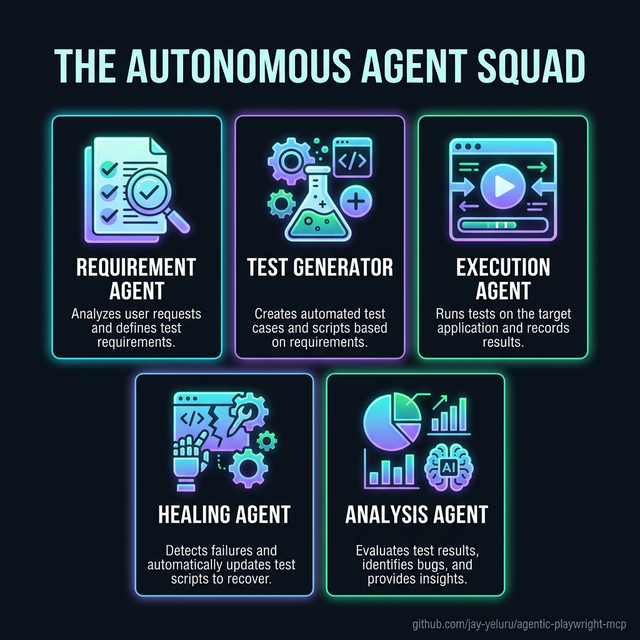
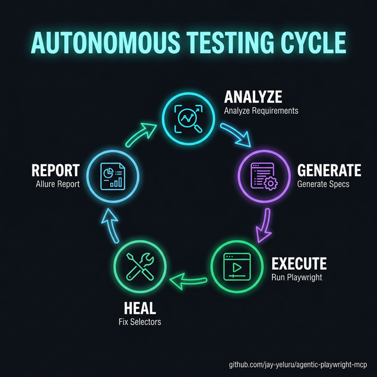

# Agentic Playwright MCP



Production-ready starter for **UI + API test automation** with Playwright, TypeScript, Page Object Model, and AI-powered agents via MCP.

This repository implements an agentic automation framework using Playwright and the Model Context Protocol (MCP).

---

## 🎯 What's Included

- **Agentic AI Test Automation** using LLM Providers (OpenAI, Copilot, Anthropic/Claude) for test intent generation
- **Playwright MCP** for standardized communication (browser automation & test execution)
- **UI testing** — Playwright Test with Page Object Model, custom fixtures, cross-browser (Chromium, Firefox, WebKit)
- **API testing** — Dedicated browser-free project for fast HTTP testing via Playwright `request` API
- **Auth setup project** — Runs once before UI tests, saves `storageState` so every test starts authenticated
- **Test data factory & utilities** — Generates test data and manages configuration
- **Allure Reporting** for rich insights
- **AI Workspace (`ai/`)** — Centralized AI Agent logic, skills, and orchestrations
- **GitHub Pages** for publishing reports

### 🤖 Meet the Agent Squad



---

## 🔄 Autonomous Testing Lifecycle



## 🚀 Getting Started

1. **Install dependencies:**

   ```bash
   npm install
   ```

2. **Set up environment:**

   ```bash
   cp .env.example .env
   # Edit .env → set BASE_URL to your app (defaults to http://localhost:3000)
   ```

3. **Set up MCP (optional, for your AI agent users):**

   ```bash
   cp .mcp.json.example .mcp.json
   ```

4. **Install Playwright browsers:**

   ```bash
   npx playwright install --with-deps
   ```

5. **Run tests:**

   ```bash
   npm test
   # Or run specific suites
   npm run test:ui
   npm run test:api
   npm run test:debug
   ```

6. **View reports:**
   ```bash
   # Opens Allure reports or Playwright default reports depending on your package.json scripts
   npm run report
   ```

---

## 🏗️ Project Structure

```
agentic-playwright-mcp/
├── ai/                     # AI Agent logic and orchestration
│   ├── agents/             # Specialized agents (requirements, generation, etc.)
│   ├── skills/             # Domain-specific AI skills
│   ├── instructions/       # System prompts and templates
│   ├── providers/          # LLM provider implementations
│   └── orchestration/      # Centralized agent management
├── docs/                   # AI Prompt Libraries and Setup Guides
├── pages/                  # Page Object Model (POM) classes
├── tests/                  # Playwright test suites (ui, api, fixtures)
├── utils/                  # Shared utilities and helpers
├── reports/                # Test execution reports and artifacts
├── .github/                # CI/CD workflows
├── playwright.config.ts    # Playwright configuration
├── package.json            # Project dependencies and scripts
└── tsconfig.json           # TypeScript configuration
```

---

## 🤖 AI Workspace

The `ai/` directory is an orchestrator-agnostic workspace for LLM Tools, Github Copilot, Claude, OpenAI, etc. It provides logic that bridges Playwright tooling with language models.

See [AGENTS.md](AGENTS.md) at the repo root for more context on AI conventions.

12 agent instructions are included out of the box to accelerate your QA workflows, including `ui-test-designer`, `api-coverage-planner`, `flake-triage`, `test-generator`, etc.

### 🩹 Intelligent Self-Healing


Copy-paste-ready AI prompts are located in the [Prompt Library](docs/PROMPT_LIBRARY.md).

---

## ⚙️ Playwright Configuration

The config defines 5 projects that run in a specific order:

```
setup → chromium, firefox, webkit (parallel)
                                        api (independent, no browser)
```

Auth state is cached between runs — if cookies are still valid, login is skipped. State is stored in `.auth/`.

---

## 📚 Documentation

- [AGENTS.md](AGENTS.md) — AI agent conventions and project standards
- [MCP Setup](docs/MCP_SETUP.md) — MCP server configuration and sanity check
- [QA Context & Conventions](docs/QA_CONTEXT.md) — scope, selectors, waits, PR slicing
- [Prompt Library](docs/PROMPT_LIBRARY.md) — copy-paste prompts for agents
- [PR Workflow](docs/PR_WORKFLOW.md) — standard PR flow
- [Security Sanitization](docs/SECURITY_SANITIZATION.md) — pre-publish checklist

---

## License

[MIT](LICENSE)
